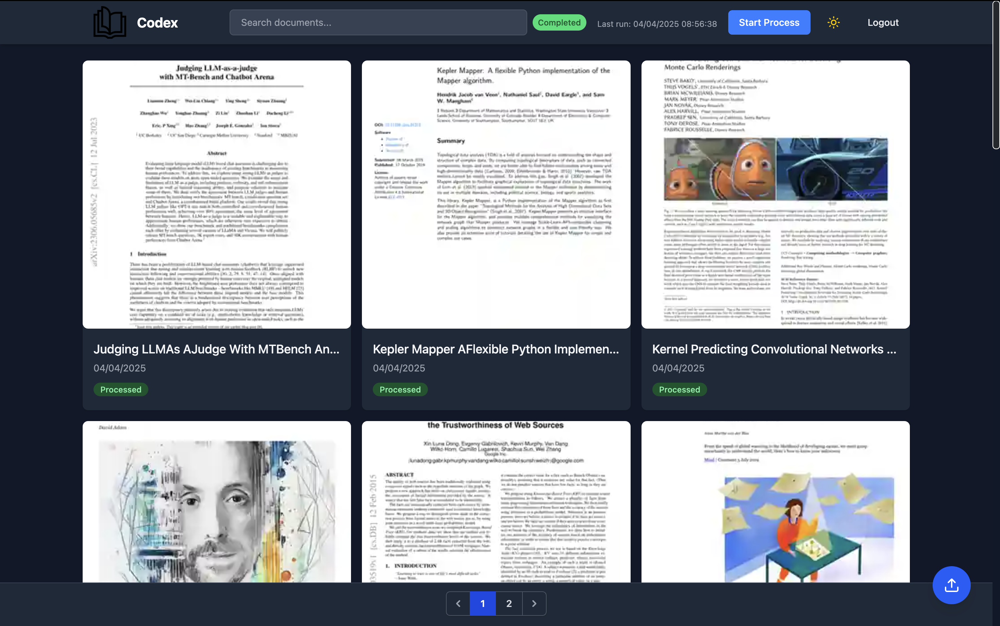
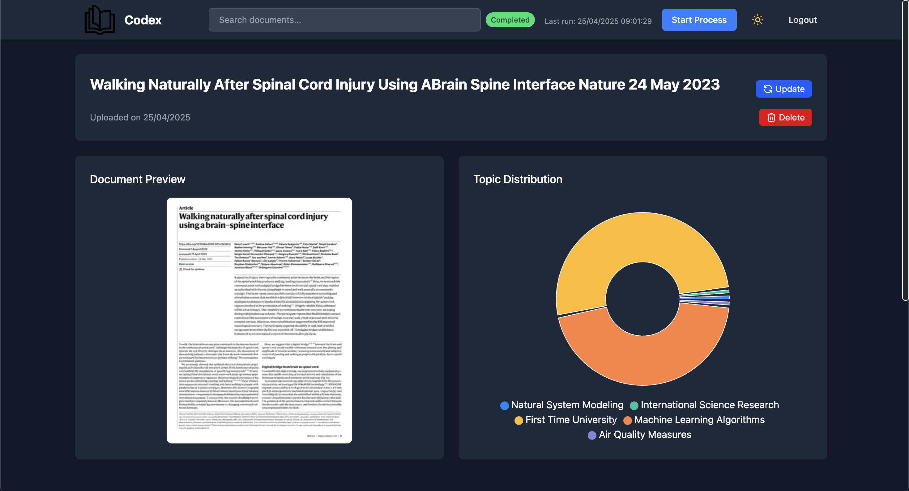

# TFE

[](https://gitlab.com/Masi-s-Matcas/tfe/-/commits/main) [](https://gitlab.com/Masi-s-Matcas/tfe/-/commits/main)

Code source du projet TFE de l'année académique 2024-2025.

## Installation

Le projet nécessite l'installation Docker et Docker Compose. Pour installer Docker, suivez les instructions sur le site officiel : [https://docs.docker.com/get-docker/](https://docs.docker.com/get-docker/).

Pour installer le projet, vous pouvez soit:

- cloner le dépôt avec les commandes suivantes :

```console
git clone https://gitlab.com/Masi-s-Matcas/tfe.git
```

```console
cd tfe
```

- ou télécharger uniquement les fichiers docker-compose.yml, .env et entrypoint.sh depuis le dépôt GitLab.

## Utilisation

Attention, due à l'utilisation de Tesseract et de LibreOffice, le container backend nécessite 4GB d'espace disque minimum.

Pour lancer le projet, lancer la commande suivante :

```console
docker compose up -d
```

Puis rendez-vous sur [http://localhost:3000](http://localhost:3000) pour accéder à l'application.

Pour arrêter le projet, lancer la commande suivante :

```console
docker compose down
```

## Screenshots

### Dashboard



### Document



## Auteur

- Mateo Castreuil
