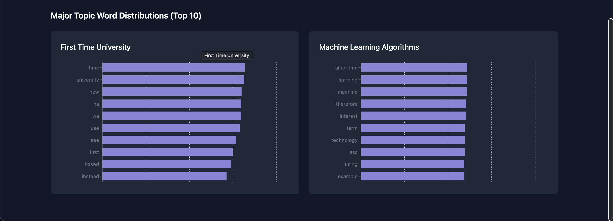

# BOLLE Emilien - Mémoire de fin d'études - 2024-2025

## Contexte

Ce travail de fin d'études a été réalisé en vue de l'obtention du diplôme de Master en Architecture des Systèmes d'Information à la Haute École Namur-Liège-Luxembourg (HENALLUX), en co-diplomation avec l'Université de Namur (UNamur). Il a été encadré par Monsieur Thomas REMY en tant que promoteur et Docteur Laurent PHILIPPE en tant que créateur du sujet.

Ce mémoire s'inscrit dans un projet de recherche regroupant plusieurs autres travaux de fin d'études. Le but de ce projet est de concevoir un assistant à l'indexation et au classement automatique de documents électroniques. Ce système doit permettre d'organiser et de retrouver facilement des documents en utilisant des techniques d'intelligence artificielle, telles que le traitement du langage naturel (NLP) et l'extraction de thèmes.

## Objectif

L'objectif de ce travail est d'intégrer deux nouvelles briques technologiques au système existant. La première brique est une base de données orientée graphe qui sera utilisée pour stocker les documents, leurs thèmes et les relations entre eux. La seconde brique est un Retrieval-Augmented Generation (RAG) qui sera utilisé pour générer des réponses à partir des documents stockés dans la base de données.

Le système existant est le fruit des travaux de plusieurs étudiants:
- Tristant BOUSCHET - TFE 2018-2019 : Etude et mise en place du modeleur de thèmes. Il a permis de concevoir un extracteur de thèmes basé sur le modèle LDA (Latent Dirichlet Allocation).
- Romain MARTINOT - Projet innovant 2020-2021 : Conception d'un outil de visualisation d'une bibliographie. Il a conçu une interface web permettant de consulter les documents d'une bibliographie personnelle et de visualiser les thèmes associés.
- Mateo CASTREUIL - TFE 2024-2025 : Conception d'une architecture backend-frontend pour le système. Son travail a permis de concevoir une infrastructure complète pour le système.

Le présent travail n'a pas pour but de recréer le système existant. Il a donc été décidé de le construire à partir de la solution de Mateo CASTREUIL. Le but est donc d'intégrer la base de données orientée graphe et le RAG dans son système.

## Branches

Deux branches principales sont disponibles dans le dépôt :
- `main` : Cette branche contient le projet forké de Mateo CASTREUIL. Il s'agit de la version de base de l'indexeur automatique de documents.
- `Graph-and-rag` : Cette branche contient le projet modifié pour intégrer la base de données orientée graphe et le RAG. Elle est basée sur la branche `main` et contient les modifications apportées au projet.

## Installation

Le projet nécessite l'installation Docker et Docker Compose. Pour installer Docker, suivez les instructions sur le site officiel : [https://docs.docker.com/get-docker/](https://docs.docker.com/get-docker/).

Une fois Docker installé, vous pouvez télécharger ou clôner le projet depuis le dépôt.

## Utilisation

Attention, due à l'utilisation de Tesseract et de LibreOffice, le container backend nécessite 4GB d'espace disque minimum.

Modifiez le fichier `.env` pour configurer les variables d'environnement.

Pour lancer le projet, lancer la commande suivante :

```bash
docker compose up -d
```

Puis rendez-vous sur [http://localhost:3000](http://localhost:3000) pour accéder à l'application.

Pour arrêter le projet, lancer la commande suivante :

```bash
docker compose down
```

## Screenshots

### Dashboard


### Document




## Auteurs

- Mateo Castreuil
- BOLLE Emilien
