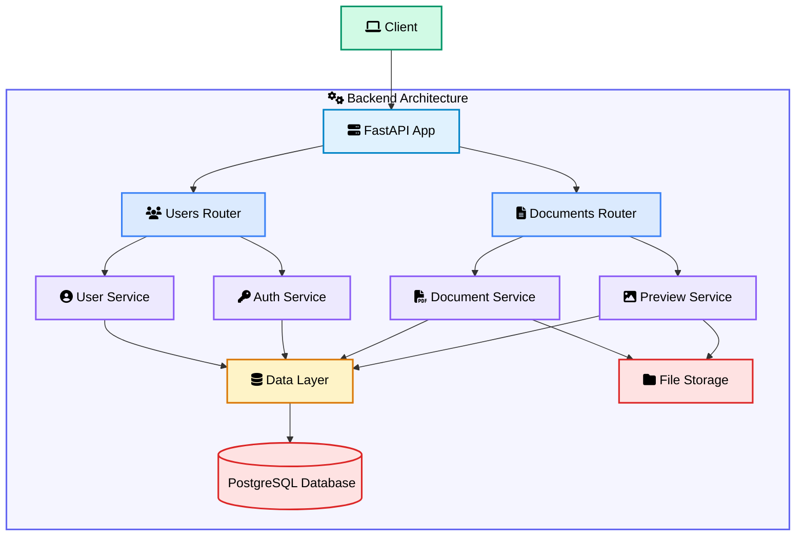

# Project Architecture Documentation

This document provides an overview of the application architecture, explaining the key components, their interactions, and the CI/CD pipeline used for development and deployment.

## System Architecture

The application follows a modern microservices architecture with clear separation between client-side and server-side components.

### Client-Side Components

The client-side consists of:
- **Client Browser**: End-user access point to the application
- **Frontend**: Built with Vite, React, and TypeScript, providing a responsive and interactive user interface

### Server-Side Components

The server-side consists of:
- **Backend**: FastAPI application handling business logic and API requests
- **PostgreSQL Database**: Persistent storage for structured data
- **Document Storage**: File system storage for document files

## Backend Architecture

The backend follows a layered architecture with clear separation of concerns.

### Backend Components

- **FastAPI App**: Main entry point handling HTTP requests
- **Routers**: Route requests to appropriate services
  - **Users Router**: Handles user registration, authentication, and management
  - **Documents Router**: Handles document operations
- **Services**: Implement business logic
  - **User Service**: User management functionality
  - **Auth Service**: Authentication and authorization
  - **Document Service**: Document operations (upload, download, etc.)
  - **Preview Service**: Document preview generation
- **Data Layer**: Abstraction for database operations
- **Storage**:
  - **Database**: Stores structured data (PostgreSQL in production, SQLite in development)
  - **File Storage**: Manages document files

## Frontend Architecture

The frontend is built with React and TypeScript, following a component-based architecture.

```mermaid
flowchart TD
    %% Main App Components
    App["fab:fa-react App"] --> AuthProvider["fa:fa-shield-alt Auth Provider"]
    App --> Router["fa:fa-route React Router"]
    
    %% Routes
    Router --> PublicRoutes["fa:fa-unlock Public Routes"]
    Router --> ProtectedRoutes["fa:fa-lock Protected Routes"]
    
    %% Public Pages
    PublicRoutes --> LoginPage["fa:fa-sign-in-alt Login Page"]
    PublicRoutes --> RegisterPage["fa:fa-user-plus Register Page"]
    
    %% Protected Pages
    ProtectedRoutes --> Dashboard["fa:fa-tachometer-alt Dashboard"]
    ProtectedRoutes --> DocumentsPage["fa:fa-folder-open Documents Page"]
    ProtectedRoutes --> DocumentViewPage["fa:fa-file-alt Document View Page"]
    ProtectedRoutes --> UserProfile["fa:fa-user-circle User Profile"]
    
    %% State Management
    subgraph StateManagement["fa:fa-database State Management"]
        style StateManagement fill:#e8f4f8,stroke:#4dabf7,stroke-width:2px,color:black
        AuthContext["fa:fa-key Auth Context"]
        DocumentsContext["fa:fa-file-contract Documents Context"]
    end
    
    %% Page Components
    Dashboard --> DocumentStats["fa:fa-chart-pie Document Stats"]
    DocumentsPage --> DocumentList["fa:fa-list Document List"]
    DocumentsPage --> DocumentFilter["fa:fa-filter Document Filter"]
    DocumentViewPage --> DocumentPreview["fa:fa-eye Document Preview"]
    DocumentViewPage --> DocumentDetails["fa:fa-info-circle Document Details"]
    
    %% API Integration
    subgraph ApiIntegration["fa:fa-network-wired API Integration"]
        style ApiIntegration fill:#fff9db,stroke:#fcc419,stroke-width:2px,color:black
        ApiService["fa:fa-cogs API Service"]
        AuthService["fa:fa-user-shield Auth Service"]
        DocumentsService["fa:fa-file-invoice Documents Service"]
    end
    
    %% Data Flow Connections
    AuthContext <--> AuthService
    DocumentsContext <--> DocumentsService
    AuthService <--> Backend["fa:fa-server Backend API"]
    DocumentsService <--> Backend
    
    %% Component Styling
    style App fill:#ffdeeb,stroke:#f06595,stroke-width:2px,color:black
    style AuthProvider fill:#ffdeeb,stroke:#f06595,stroke-width:2px,color:black
    style Router fill:#ffdeeb,stroke:#f06595,stroke-width:2px,color:black
    
    style PublicRoutes fill:#e3fafc,stroke:#22b8cf,stroke-width:2px,color:black
    style ProtectedRoutes fill:#e3fafc,stroke:#22b8cf,stroke-width:2px,color:black
    
    style LoginPage fill:#d3f9d8,stroke:#40c057,stroke-width:2px,color:black
    style RegisterPage fill:#d3f9d8,stroke:#40c057,stroke-width:2px,color:black
    style Dashboard fill:#d3f9d8,stroke:#40c057,stroke-width:2px,color:black
    style DocumentsPage fill:#d3f9d8,stroke:#40c057,stroke-width:2px,color:black
    style DocumentViewPage fill:#d3f9d8,stroke:#40c057,stroke-width:2px,color:black
    style UserProfile fill:#d3f9d8,stroke:#40c057,stroke-width:2px,color:black
    
    style DocumentStats fill:#f4f6f8,stroke:#adb5bd,stroke-width:2px,color:black
    style DocumentList fill:#f4f6f8,stroke:#adb5bd,stroke-width:2px,color:black
    style DocumentFilter fill:#f4f6f8,stroke:#adb5bd,stroke-width:2px,color:black
    style DocumentPreview fill:#f4f6f8,stroke:#adb5bd,stroke-width:2px,color:black
    style DocumentDetails fill:#f4f6f8,stroke:#adb5bd,stroke-width:2px,color:black
    
    style AuthContext fill:#e8f4f8,stroke:#4dabf7,stroke-width:2px,color:black
    style DocumentsContext fill:#e8f4f8,stroke:#4dabf7,stroke-width:2px,color:black
    
    style ApiService fill:#fff9db,stroke:#fcc419,stroke-width:2px,color:black
    style AuthService fill:#fff9db,stroke:#fcc419,stroke-width:2px,color:black
    style DocumentsService fill:#fff9db,stroke:#fcc419,stroke-width:2px,color:black
    
    style Backend fill:#f8f0fc,stroke:#cc5de8,stroke-width:2px,color:black
```

### Frontend Components

- **App**: Root component
- **Router**: Handles navigation between pages
- **Pages**:
  - **Auth Pages**: Login and registration
  - **Dashboard**: Main interface showing document list
  - **Document Page**: Document viewing and management
- **Components**:
  - **DocumentList/Item**: List of available documents and individual items
  - **DocumentViewer**: Document preview component
  - **DocumentMetadata**: Shows document information
- **Services**:
  - **AuthService**: Handles authentication with backend
  - **DocumentsService**: Manages document operations

## CI/CD Pipeline

The project uses GitLab CI/CD for continuous integration and deployment, ensuring code quality and automating the build process.

```mermaid
flowchart LR
    %% Source code
    Source["fa:fa-code Source Code"]
    
    %% Stage: Lint
    subgraph LintStage["fa:fa-search-plus Lint Stage"]
        style LintStage fill:#e0f7fa,stroke:#0277bd,stroke-width:2px,color:black
        LintB["fab:fa-python Backend Linting<br><i>flake8, black</i>"]
        LintF["fab:fa-js Frontend Linting<br><i>eslint</i>"]
    end
    
    %% Stage: Test
    subgraph TestStage["fa:fa-vial Test Stage"]
        style TestStage fill:#e1f5fe,stroke:#0288d1,stroke-width:2px,color:black
        TestB["fa:fa-flask Backend Tests<br><i>pytest</i>"]
        TestF["fa:fa-check-square Frontend Tests<br><i>jest</i>"]
    end
    
    %% Stage: Build
    subgraph BuildStage["fa:fa-hammer Build Stage"]
        style BuildStage fill:#e8f5e9,stroke:#2e7d32,stroke-width:2px,color:black
        DockerBuildB["fab:fa-docker Docker Build Backend<br><i>multi-platform</i>"]
        DockerBuildF["fab:fa-docker Docker Build Frontend<br><i>multi-platform</i>"]
    end
    
    %% Registries
    subgraph Registries["fa:fa-cloud Registry"]
        style Registries fill:#f3e5f5,stroke:#7b1fa2,stroke-width:2px,color:black
        GitlabRegistry["fab:fa-gitlab GitLab Registry"]
        DockerHubRegistry["fab:fa-docker DockerHub"]
    end
    
    %% Deployment (which happens after CI/CD)
    subgraph Deployment["fa:fa-rocket Deployment"]
        style Deployment fill:#fff3e0,stroke:#ef6c00,stroke-width:2px,color:black
        BackendContainer["fa:fa-server Backend Container"]
        FrontendContainer["fa:fa-desktop Frontend Container"]
        PostgreContainer["fa:fa-database PostgreSQL Container"]
    end
    
    %% Volumes
    DBVolume["fa:fa-database Database Volume"]
    DocumentsVolume["fa:fa-folder Documents Volume"]
    
    %% Connections
    Source --> LintB
    Source --> LintF
    
    LintB --> TestB
    LintF --> TestF
    
    TestB --> DockerBuildB
    TestF --> DockerBuildF
    
    DockerBuildB --> GitlabRegistry
    DockerBuildB --> DockerHubRegistry
    DockerBuildF --> GitlabRegistry
    DockerBuildF --> DockerHubRegistry
    
    GitlabRegistry --> BackendContainer
    GitlabRegistry --> FrontendContainer
    DockerHubRegistry --> BackendContainer
    DockerHubRegistry --> FrontendContainer
    DockerHubRegistry --> PostgreContainer
    
    BackendContainer --> DocumentsVolume
    PostgreContainer --> DBVolume
    
    %% Node styling
    style Source fill:#e3f2fd,stroke:#1976d2,stroke-width:2px,color:black
    
    style LintB fill:#e0f7fa,stroke:#0277bd,stroke-width:1px,color:black
    style LintF fill:#e0f7fa,stroke:#0277bd,stroke-width:1px,color:black
    
    style TestB fill:#e1f5fe,stroke:#0288d1,stroke-width:1px,color:black
    style TestF fill:#e1f5fe,stroke:#0288d1,stroke-width:1px,color:black
    
    style DockerBuildB fill:#e8f5e9,stroke:#2e7d32,stroke-width:1px,color:black
    style DockerBuildF fill:#e8f5e9,stroke:#2e7d32,stroke-width:1px,color:black
    
    style GitlabRegistry fill:#f3e5f5,stroke:#7b1fa2,stroke-width:1px,color:black
    style DockerHubRegistry fill:#f3e5f5,stroke:#7b1fa2,stroke-width:1px,color:black
    
    style BackendContainer fill:#fff3e0,stroke:#ef6c00,stroke-width:1px,color:black
    style FrontendContainer fill:#fff3e0,stroke:#ef6c00,stroke-width:1px,color:black
    style PostgreContainer fill:#fff3e0,stroke:#ef6c00,stroke-width:1px,color:black
    
    style DBVolume fill:#fce4ec,stroke:#c2185b,stroke-width:1px,color:black
    style DocumentsVolume fill:#fce4ec,stroke:#c2185b,stroke-width:1px,color:black
```

### CI/CD Pipeline Components

1. **Lint Stage**:
   - Backend: Uses flake8 and black for code style checking
   - Frontend: Uses ESLint for JavaScript/TypeScript linting

2. **Test Stage**:
   - Backend: Uses pytest for unit and integration tests with coverage reporting
   - Frontend: Uses Jest for component and unit testing

3. **Build Stage**:
   - Multi-platform Docker builds (amd64, arm64)
   - Pushes images to both GitLab Registry and DockerHub

4. **Deployment**:
   - Containerized deployment using Docker Compose
   - Three main containers: Frontend, Backend, and PostgreSQL
   - Additional container for pgAdmin (database management)
   - Persistent volumes for database and document storage

## Deployment Architecture

The application is deployed using Docker containers orchestrated with Docker Compose:

- **Frontend Container**: NGINX serving the React application (port 3000)
- **Backend Container**: FastAPI application (port 8000)
- **PostgreSQL Container**: Database (port 5432, not exposed)
- **PGAdmin Container**: Database management interface (port 5050)

### Persistent Storage

- **Document Storage**: Docker volume mounted to the backend container
- **Database Storage**: Docker volume for PostgreSQL data persistence

## Environment Configuration

The application uses environment variables for configuration:

- Database connection parameters
- Storage paths for documents
- External tool paths (Tesseract for OCR, LibreOffice for document conversion)

## Security Considerations

- PostgreSQL credentials are managed via environment variables
- API endpoints are protected with authentication
- Database is not directly exposed to external network
- Document storage is isolated within Docker volumes

This architecture provides a scalable, maintainable solution with clear separation of concerns, modern development practices, and a robust CI/CD pipeline.